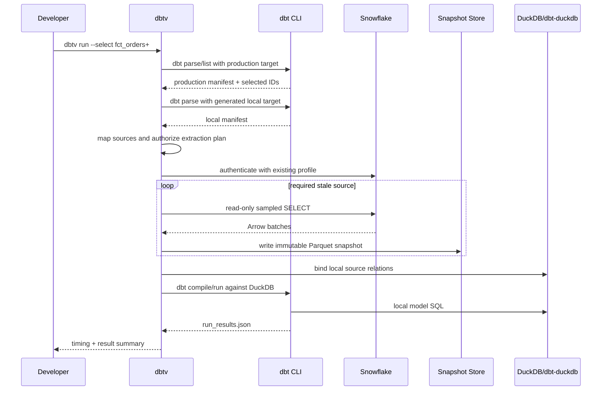
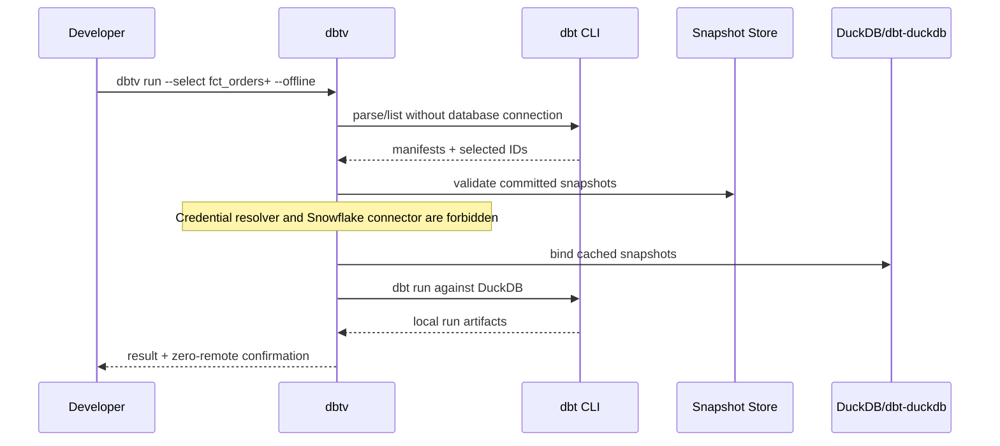

# `dbtv`: Snowflake-to-DuckDB Local dbt Accelerator

## Hyper-Detailed, Composable Architecture and Implementation Plan

**Document status:** Implementation-ready design  
**Initial product scope:** Snowflake source data, local DuckDB execution, Python CLI  
**Primary optimization target:** Repeated local `dbt run`, `dbt test`, and `dbt build` feedback loops  
**Design objective:** Snowflake is the first source plugin, DuckDB is the fixed initial execution backend, and provider-specific behavior never leaks into the orchestration core.

### How to use this document

- Sections 1–5 define the product, scope, decisions, and invariants.
- Sections 6–9 define the architecture, modules, domain values, and plugin contracts.
- Sections 10–12 specify the CLI, configuration, workspace, and artifacts.
- Sections 13–21 specify planning, authentication, extraction, sampling, caching, binding, local dbt execution, and compatibility.
- Sections 22–27 cover orchestration, concurrency, security, recovery, observability, and version management.
- Sections 28–33 provide tests, benchmarks, phased tickets, acceptance scenarios, and the MVP definition of done.
- Sections 34–38 provide risks, the future-provider recipe, open decisions, implementation order, and primary references.

---

## 1. Executive summary

`dbtv` is a Python CLI that accelerates dbt development by paying the remote data-access cost once and then executing repeated dbt transformations locally in DuckDB.

The intended developer experience is:

```bash
# Existing remote workflow
dbt run --select fct_orders+

# Accelerated local workflow
dbtv run --select fct_orders+

# Guaranteed not to connect to Snowflake
dbtv run --select fct_orders+ --offline
```

For a selected dbt subgraph, `dbtv` will:

1. Parse the project without querying Snowflake.
2. Delegate dbt selector semantics to dbt rather than reimplementing them.
3. Discover the exact upstream dbt sources required by the selection.
4. Resolve the existing Snowflake dbt profile and authentication mode without persisting credentials.
5. Extract a configured working set from each required Snowflake source as Arrow batches.
6. Commit those batches as immutable, reusable local Parquet snapshots.
7. Bind the snapshots to the relation names expected by a generated DuckDB dbt target.
8. Invoke dbt with `dbt-duckdb`, preserving dbt's model, materialization, test, hook, and artifact behavior.
9. Produce human-readable timing and machine-readable run artifacts.
10. Permit subsequent `--offline` runs that make zero Snowflake connections and queries.

The central product promise is:

> Extract the smallest useful Snowflake working set once, then iterate on selected dbt models and tests locally in DuckDB until the source snapshot changes.

The most important architectural decision is that `dbtv` will **not** implement its own general-purpose dbt runner. The manifest is used for planning and source discovery; dbt remains responsible for compilation and execution semantics. This avoids rebuilding an expanding surface that includes materializations, tests, seeds, hooks, packages, adapter dispatch, incremental strategies, and failure propagation.

---

## 2. Product scope

### 2.1 MVP use case

A developer is working in an existing, large dbt project whose production target is Snowflake. Remote `dbt run` is slow because of authentication, warehouse startup, network latency, introspection, queuing, remote execution, and tests. The developer wants to select a model or subgraph, fetch only the required source data, and perform repeated transformations locally.

### 2.2 In scope for the first usable release

- A Python CLI named `dbtv`.
- Existing dbt projects using a Snowflake production target.
- Existing `profiles.yml` files and environment-variable-based credentials.
- Snowflake password, key-pair, OAuth, external-browser/SSO, and supported authenticator flows, subject to connector capabilities and enterprise policy.
- Offline project parsing and selection planning.
- dbt-compatible `--select`, `--exclude`, `--selector`, `--vars`, and `--full-refresh` handling where the installed dbt version supports them.
- Extraction of only sources upstream of the selected local execution graph.
- Arrow batch streaming from Snowflake.
- Immutable Parquet snapshots with provenance metadata.
- Persistent local DuckDB output database.
- Source binding across database, schema, and identifier names.
- Local dbt `run`, `test`, and `build` using `dbt-duckdb`.
- Table, view, ephemeral, seed, standard data tests, and supported incremental models.
- A compatibility analyzer and explicit unsupported-feature reporting.
- Cold, warm, refresh, and strictly offline run modes.
- Human, JSON, and quiet output modes.
- Robust cancellation, atomic cache commits, file locking, and recovery.
- Security controls suitable for a large-company pilot.

### 2.3 Explicitly out of scope for the first release

- Copying an entire enterprise database by default.
- Pretending that sampled results are production-equivalent.
- Silently approximating unsupported Snowflake behavior.
- A custom replacement for dbt's materialization or test engine.
- A graphical user interface.
- A mandatory background daemon.
- Databricks, Iceberg, Delta, BigQuery, Redshift, or Postgres implementations.
- Production scheduling or orchestration.
- Writing local model results back to Snowflake.
- Production-grade row-level diff as a user feature; comparison may exist in the test harness.
- Transparent support for arbitrary Snowflake UDFs, stored procedures, external functions, dynamic tables, streams, tasks, or security-policy behavior.
- Guaranteed local support for every dbt package or every dbt version.
- Automatic extraction of data that enterprise policy prohibits from being stored on developer machines.

### 2.4 Future scope enabled by the design

- Databricks SQL Arrow extraction.
- Direct Iceberg, Delta, Unity Catalog, Parquet, or database attachments.
- A remote-result comparison backend.
- Relationship-aware multi-table cohort sampling.
- Content-based local model reuse.
- An optional warm local service behind the same CLI.
- A Go or Rust launcher without changing core execution semantics.
- Enterprise policy, audit, and telemetry plugins.

---

## 3. Goals, non-goals, and success criteria

### 3.1 Functional goals

1. A developer can replace common `dbt` commands with corresponding `dbtv` commands.
2. `dbtv` discovers required sources from dbt metadata; users do not manually enumerate dependencies.
3. Existing Snowflake credentials are reused in memory and are never copied into `dbtv.yml`, the DuckDB profile, snapshot metadata, or logs.
4. Cached sources can be reused across repeated local runs.
5. `--offline` has a mechanically enforceable guarantee: no source connector may be opened.
6. DuckDB source relations match the local dbt manifest exactly.
7. dbt remains the authority for model selection, compilation, materialization, testing, and run artifacts.
8. Unsupported behavior fails clearly before or during compilation rather than returning plausible but incorrect results.
9. Provider-specific code is loaded through typed interfaces and a registry.
10. Adding a future source does not require modifying planning, caching, binding, execution, or reporting logic.

### 3.2 Performance goals

Absolute targets must be calibrated against a representative company project. The release gates should use both absolute and relative measurements.

| Measurement | Initial gate |
|---|---:|
| `dbtv --help` warm startup | p95 under 500 ms on the supported developer baseline |
| `dbtv status` with 100 cached sources | p95 under 1 second |
| Offline planning | No network calls; no Snowflake connection |
| Warm offline selected run | At least 5× faster than the equivalent median remote run, or under 20% of its wall time |
| Warm source-cache hit rate during iterative development | At least 90% in the pilot workflow |
| Extraction memory | Bounded by configured batch buffers rather than total result size |
| Offline remote query count | Exactly zero |
| Cache corruption handling | Detect before local execution; never consume an incomplete snapshot |
| Secret leakage tests | Zero resolved credentials in files, logs, exceptions, or telemetry |

The tool must report the following timing spans on every run:

- CLI initialization
- project discovery
- production parse
- local parse
- selection resolution
- plan construction
- credential resolution
- Snowflake connection/login
- warehouse/query wait
- source extraction per table
- Parquet write per table
- local source binding
- compatibility compilation
- dbt execution
- artifact normalization
- total wall time

### 3.3 Correctness goals

- Every snapshot has a complete provenance record.
- Every bound relation is verified with a schema-only local query before dbt execution.
- Source identity mapping is based on dbt `unique_id`, not matching physical names heuristically.
- Every lossy type conversion produces a warning or error according to the configured fidelity mode.
- Non-deterministic sampling is labeled as such.
- A local pass is described as a pass against the named local snapshot, never as proof that production will pass.

### 3.4 Non-goals

- Making the cold extraction of a very large source faster than every possible remote dbt run.
- Eliminating all dialect differences automatically.
- Inferring safe local-data policy without explicit company rules.
- Maintaining a fork of dbt Core, `dbt-snowflake`, or `dbt-duckdb`.

---

## 4. Architectural decisions

### ADR-001: Python for the MVP

**Decision:** Implement the CLI and orchestration core in Python.

**Reason:** dbt Core adapters, Snowflake connectivity, PyArrow, and DuckDB have mature Python integration. Most work happens in native libraries or subprocesses, so Python is primarily orchestration code.

**Guardrail:** Heavy imports are lazy. Connector SDKs are imported only after a plan requires them.

### ADR-002: Subprocess dbt integration

**Decision:** Invoke the project's installed `dbt` executable through a subprocess boundary.

**Reason:** Private dbt Python APIs change more frequently than CLI and artifact contracts. Subprocess isolation also prevents dbt global state from contaminating the CLI process.

**Guardrail:** A `DbtInvoker` interface owns every invocation and normalizes command, environment, stdout, stderr, exit code, and artifacts.

### ADR-003: dbt owns execution semantics

**Decision:** Use `dbt-duckdb` for local execution. Do not build a manifest-driven materialization engine.

**Reason:** The manifest is a project representation, not a complete stable execution protocol. dbt already implements DAG ordering, tests, seeds, failure propagation, materializations, hooks, and artifacts.

### ADR-004: Two manifests, mapped by `unique_id`

**Decision:** Build a production-target manifest and a local-target manifest, and map source nodes by dbt `unique_id`.

**Reason:** A source has two distinct physical representations:

- the production Snowflake relation from which data is extracted; and
- the local DuckDB relation to which the snapshot must be bound.

Target-dependent Jinja can make those relation names different. Treating them as a single name would leak Snowflake assumptions into DuckDB.

### ADR-005: Arrow is the connector boundary; Parquet is the persistent snapshot boundary

**Decision:** A source connector yields Arrow batches. The default snapshot store commits them as Parquet plus metadata.

**Reason:** Arrow provides a columnar streaming interchange contract; Parquet provides efficient, immutable, inspectable local reuse. DuckDB can query both directly.

### ADR-006: Source snapshots are immutable

**Decision:** Never mutate a committed snapshot in place. A refresh creates a new snapshot and atomically advances the current pointer.

**Reason:** This enables reproducibility, safe cancellation, concurrent readers, corruption detection, and rollback.

### ADR-007: Cache policy is distinct from cache identity

**Decision:** TTL determines whether to refresh; it does not define snapshot identity.

**Reason:** A snapshot key must include source identity, extraction request, schema/fidelity policy, and upstream version information when available.

### ADR-008: Fail closed on semantic uncertainty

**Decision:** Unsupported SQL or type behavior fails or warns according to an explicit compatibility policy.

**Reason:** Syntactic executability does not prove equivalent semantics.

### ADR-009: No mandatory daemon

**Decision:** Every workflow works as a normal CLI invocation. A daemon may later optimize startup but cannot be required for correctness.

### ADR-010: Plugin shape from day one

**Decision:** Even the built-in Snowflake implementation is registered through the same connector registry future providers will use.

**Reason:** A “temporary” direct import or provider branch tends to become permanent architecture.

---

## 5. Architectural invariants

These rules are enforced in code review and architecture tests:

1. `dbtv.core`, `dbtv.project`, `dbtv.cache`, `dbtv.local`, and `dbtv.reporting` may not import `snowflake.*`.
2. Only the Snowflake connector and its credential adapter know Snowflake connection fields or SQL syntax.
3. Core domain models contain no Snowflake SDK objects, DuckDB connection objects, or dbt internal classes.
4. All physical source mapping crosses the core as `SourceRef`, `RemoteRelation`, and `LocalRelation` values.
5. A connector returns Arrow batches or a declared direct-read handle; it never writes into DuckDB itself.
6. The snapshot store does not authenticate to Snowflake.
7. The DuckDB binder does not build extraction SQL.
8. The dbt runner receives a prepared local workspace and does not resolve production credentials.
9. Reporters consume normalized events and artifacts, not live connector or database objects.
10. `--offline` is checked before credential resolution and connector construction.
11. Every committed snapshot contains `_SUCCESS` and valid metadata before it can be selected.
12. Every run has a unique invocation ID and immutable run record.
13. A local database is written by at most one `dbtv` process at a time.
14. Any plugin capability is discovered through `capabilities()`, never through `isinstance` or provider-name branching.
15. Unknown dbt artifact schema versions result in a clear compatibility error unless a tolerant projection has been explicitly tested.

---

## 6. System architecture

```mermaid
flowchart LR
    CLI[dbtv CLI] --> ORCH[Run Orchestrator]
    ORCH --> PP[Project Planner]
    PP --> DBTI[dbt Subprocess Invoker]
    DBTI --> PM[Production Manifest]
    DBTI --> LM[Local Manifest]

    PP --> PLAN[Execution Plan]
    PLAN --> POLICY[Policy Engine]
    POLICY --> CREDS[Credential Resolver]
    CREDS --> REG[Connector Registry]
    REG --> SF[Snowflake Connector]
    SF --> ARROW[Arrow Batch Stream]
    ARROW --> STORE[Snapshot Store]
    STORE --> PARQUET[(Immutable Parquet Snapshots)]

    PARQUET --> BINDER[DuckDB Source Binder]
    LM --> BINDER
    BINDER --> CATALOGS[(Local Source Catalogs)]
    BINDER --> PROFILE[Generated DuckDB Profile]

    PROFILE --> COMPAT[Compatibility Analyzer]
    COMPAT --> DBTRUN[dbt-duckdb Run/Test/Build]
    CATALOGS --> DBTRUN
    DBTRUN --> LOCALDB[(Local DuckDB)]
    DBTRUN --> RESULTS[dbt Artifacts]
    RESULTS --> REPORT[Normalized Reporter]
```



### 6.1 Cold-run sequence



### 6.2 Warm offline sequence



---

## 7. Terminology and core domain model

| Term | Meaning |
|---|---|
| Production target | The existing dbt Snowflake target used to resolve production graph and physical source names. |
| Local target | A generated dbt-duckdb target used only for local parsing, compilation, and execution. |
| Logical source | A dbt source node identified by `source.<package>.<source_name>.<table_name>` or its actual manifest `unique_id`. |
| Remote relation | The Snowflake database, schema, and identifier resolved from the production manifest. |
| Local relation | The DuckDB catalog, schema, and identifier resolved from the local manifest. |
| Working set | The data subset chosen for local development. |
| Snapshot | An immutable materialization of one logical source under one extraction request and provenance record. |
| Snapshot policy | Rules for deciding whether an existing snapshot may be reused. |
| Snapshot identity | Canonical content-addressing inputs that distinguish snapshots. |
| Binding | Making a snapshot queryable at the exact local relation expected by dbt. |
| Compatibility finding | A structured warning or error about local semantic support. |
| Cold run | A run that must extract one or more sources. |
| Warm run | A run that reuses all required snapshots. |
| Offline run | A run where remote connector creation is prohibited. |

---

## 8. Repository and package structure

```text
dbtv/
├── pyproject.toml
├── README.md
├── CHANGELOG.md
├── LICENSE
├── src/
│   └── dbtv/
│       ├── __init__.py
│       ├── __main__.py
│       ├── cli/
│       │   ├── app.py
│       │   ├── context.py
│       │   ├── options.py
│       │   ├── commands/
│       │   │   ├── init.py
│       │   │   ├── doctor.py
│       │   │   ├── plan.py
│       │   │   ├── sync.py
│       │   │   ├── run.py
│       │   │   ├── test.py
│       │   │   ├── build.py
│       │   │   ├── status.py
│       │   │   ├── inspect.py
│       │   │   └── clean.py
│       │   └── exit_codes.py
│       ├── core/
│       │   ├── models.py
│       │   ├── enums.py
│       │   ├── errors.py
│       │   ├── events.py
│       │   ├── hashing.py
│       │   ├── redaction.py
│       │   ├── clock.py
│       │   └── registry.py
│       ├── config/
│       │   ├── loader.py
│       │   ├── schema.py
│       │   ├── defaults.py
│       │   └── migration.py
│       ├── project/
│       │   ├── discovery.py
│       │   ├── dbt_invoker.py
│       │   ├── artifacts.py
│       │   ├── manifest.py
│       │   ├── selection.py
│       │   ├── fingerprint.py
│       │   ├── graph.py
│       │   └── planner.py
│       ├── credentials/
│       │   ├── base.py
│       │   ├── dbt_profiles.py
│       │   └── snowflake_profile.py
│       ├── connectors/
│       │   ├── base.py
│       │   ├── registry.py
│       │   └── snowflake/
│       │       ├── connector.py
│       │       ├── capabilities.py
│       │       ├── query_builder.py
│       │       ├── type_mapping.py
│       │       ├── retry.py
│       │       └── errors.py
│       ├── sampling/
│       │   ├── models.py
│       │   ├── planner.py
│       │   ├── deterministic.py
│       │   └── cohort.py
│       ├── snapshots/
│       │   ├── base.py
│       │   ├── key.py
│       │   ├── metadata.py
│       │   ├── parquet_store.py
│       │   ├── index.py
│       │   ├── policy.py
│       │   ├── integrity.py
│       │   └── gc.py
│       ├── local/
│       │   ├── workspace.py
│       │   ├── profile.py
│       │   ├── catalog_map.py
│       │   ├── binder.py
│       │   ├── shims.py
│       │   ├── duckdb_backend.py
│       │   └── locks.py
│       ├── compatibility/
│       │   ├── base.py
│       │   ├── analyzer.py
│       │   ├── sql_rules.py
│       │   ├── manifest_rules.py
│       │   ├── types.py
│       │   └── report.py
│       ├── execution/
│       │   ├── orchestrator.py
│       │   ├── state_machine.py
│       │   ├── dbt_runner.py
│       │   ├── artifacts.py
│       │   └── cancellation.py
│       ├── policy/
│       │   ├── base.py
│       │   ├── local_policy.py
│       │   └── findings.py
│       └── reporting/
│           ├── base.py
│           ├── console.py
│           ├── json.py
│           ├── timing.py
│           └── logs.py
├── tests/
│   ├── unit/
│   ├── contract/
│   ├── integration/
│   ├── e2e/
│   ├── performance/
│   ├── security/
│   ├── fixtures/
│   └── dbt_projects/
└── docs/
    ├── architecture.md
    ├── compatibility.md
    ├── configuration.md
    ├── security.md
    └── troubleshooting.md
```

Initially, the Snowflake connector can ship in the same distribution, but it must be loaded through an entry-point registry:

```toml
[project.entry-points."dbtv.source_connectors"]
snowflake = "dbtv.connectors.snowflake.connector:SnowflakeConnectorFactory"
```

Future distributions can move the implementation to `dbtv-source-snowflake` without changing imports in the orchestration core.

---

## 9. Core interfaces

The following contracts describe architecture, not exact final syntax. They should be implemented as `typing.Protocol` or small abstract base classes and verified with contract tests.

### 9.1 Source and relation values

```python
from dataclasses import dataclass
from typing import Mapping


@dataclass(frozen=True)
class SourceRef:
    unique_id: str
    package_name: str
    source_name: str
    table_name: str


@dataclass(frozen=True)
class RemoteRelation:
    catalog: str | None
    schema: str
    identifier: str
    quoting: Mapping[str, bool]


@dataclass(frozen=True)
class LocalRelation:
    catalog: str | None
    schema: str
    identifier: str
    quoting: Mapping[str, bool]
```

`SourceRef` is the join key between production and local manifests. Physical relation components are never used as the logical identity.

### 9.2 Connector capabilities

```python
@dataclass(frozen=True)
class SourceCapabilities:
    arrow_streaming: bool
    projection_pushdown: bool
    predicate_pushdown: bool
    limit_pushdown: bool
    bernoulli_sampling: bool
    deterministic_sampling: bool
    snapshot_identity: bool
    consistent_snapshot_time: bool
    direct_duckdb_read: bool
    cancellable_queries: bool
```

The planner asks for capabilities and chooses a valid strategy. It does not branch on connector name.

### 9.3 Credential resolver

```python
class CredentialResolver(Protocol):
    def supports(self, profile_type: str) -> bool: ...

    def resolve(
        self,
        *,
        profiles_dir: Path,
        profile_name: str,
        target_name: str,
        env: Mapping[str, str],
        interactive: bool,
    ) -> ResolvedCredentialHandle: ...
```

`ResolvedCredentialHandle` exposes connection parameters to the connector in memory. Its `repr`, string conversion, and serialization are prohibited or redacted.

### 9.4 Source connector

```python
class SourceConnector(Protocol):
    def capabilities(self) -> SourceCapabilities: ...

    def open(self) -> None: ...

    def close(self) -> None: ...

    def inspect_schema(
        self,
        relation: RemoteRelation,
    ) -> CanonicalSchema: ...

    def source_version(
        self,
        relation: RemoteRelation,
    ) -> SourceVersion | None: ...

    def estimate(
        self,
        request: SnapshotRequest,
    ) -> ExtractionEstimate | None: ...

    def extract(
        self,
        request: SnapshotRequest,
        cancellation: CancellationToken,
    ) -> ArrowBatchStream: ...

    def cancel(self, query_id: str) -> None: ...
```

The connector owns authentication, identifier quoting, provider SQL generation, provider types, retries, query identifiers, and cancellation. It does not choose cache directories or local relation names.

### 9.5 Snapshot store

```python
class SnapshotStore(Protocol):
    def lookup(self, key: SnapshotKey) -> DatasetSnapshot | None: ...

    def begin(self, metadata: PendingSnapshotMetadata) -> SnapshotWriter: ...

    def commit(self, writer: SnapshotWriter) -> DatasetSnapshot: ...

    def validate(self, snapshot: DatasetSnapshot) -> IntegrityReport: ...

    def activate(self, source: SourceRef, snapshot: DatasetSnapshot) -> None: ...

    def garbage_collect(self, policy: RetentionPolicy) -> GcReport: ...
```

### 9.6 Policy engine

```python
class PolicyEngine(Protocol):
    def evaluate(self, plan: ExecutionPlan) -> PolicyDecision: ...
```

The default implementation enforces local configuration. A future enterprise plugin can use source tags, catalog metadata, user identity, or company policy without changing the planner.

### 9.7 Local backend and binder

```python
class LocalExecutionBackend(Protocol):
    def prepare(self, plan: ExecutionPlan) -> PreparedLocalWorkspace: ...

    def bind(
        self,
        workspace: PreparedLocalWorkspace,
        bindings: list[SourceBinding],
    ) -> BindingReport: ...

    def verify(self, workspace: PreparedLocalWorkspace) -> VerificationReport: ...

    def execute(
        self,
        request: DbtExecutionRequest,
        cancellation: CancellationToken,
    ) -> DbtExecutionResult: ...
```

The initial implementation is `DuckDbExecutionBackend`. The interface is not intended to encourage multiple local engines immediately; it makes the execution boundary testable.

### 9.8 Compatibility analyzer

```python
class CompatibilityAnalyzer(Protocol):
    def analyze_plan(self, plan: ExecutionPlan) -> list[CompatibilityFinding]: ...

    def analyze_compile(
        self,
        compiled_artifacts: DbtArtifacts,
    ) -> list[CompatibilityFinding]: ...
```

Every finding contains a stable rule ID, severity, node ID, file path if known, explanation, remediation, and whether execution may continue.

### 9.9 Reporter

```python
class Reporter(Protocol):
    def emit(self, event: RunEvent) -> None: ...
    def finalize(self, summary: RunSummary) -> None: ...
```

Console, JSON, and quiet reporters consume the same normalized event stream.

---

## 10. CLI specification

### 10.1 Command philosophy

- Mirror dbt vocabulary and selection behavior.
- Make the main path require minimal new concepts.
- Keep local-data controls visibly separate from dbt flags.
- Make network behavior explicit and auditable.
- Support non-interactive CI without degrading interactive UX.
- Never require users to read logs to understand whether remote data was accessed.

### 10.2 Commands

| Command | Purpose |
|---|---|
| `dbtv init` | Discover the project and generate a safe initial `dbtv.yml` plus `.gitignore` suggestions. |
| `dbtv doctor` | Validate Python environment, dbt executable, adapters, profiles, authentication capability, DuckDB, permissions, disk, and compatibility. |
| `dbtv plan` | Resolve selection and show required sources, snapshot decisions, estimated extraction, policy findings, and local execution nodes without extracting or executing. |
| `dbtv sync` | Refresh or validate required source snapshots without building models. |
| `dbtv run` | Prepare sources and invoke local `dbt run`. |
| `dbtv test` | Prepare sources and invoke local `dbt test`. |
| `dbtv build` | Prepare sources and invoke local `dbt build`. |
| `dbtv status` | Show active snapshots, ages, data profiles, sizes, local database, recent runs, and locks. |
| `dbtv inspect` | Open DuckDB CLI/UI or run a supplied read-only local query. |
| `dbtv clean` | Remove selected local artifacts with an explicit preview. |
| `dbtv version` | Show CLI, Python, dbt, adapters, DuckDB, connector, and artifact schema versions. |

### 10.3 Global options

```text
--project-dir PATH
--profiles-dir PATH
--profile NAME
--target NAME                  # production target
--config PATH
--output console|json
--log-level error|warning|info|debug
--log-path PATH
--no-color
--quiet
--non-interactive
--invocation-id UUID           # normally generated
```

### 10.4 Shared selection options

```text
--select SELECTOR...
--exclude SELECTOR...
--selector NAME
--vars YAML_OR_JSON
--full-refresh
```

The exact selector string is passed to dbt. `dbtv` does not define a competing grammar.

### 10.5 Local data options

```text
--source-mode auto|refresh|cached|offline
--data-profile NAME
--cache-ttl DURATION
--max-rows INTEGER
--max-bytes SIZE
--allow-full-source
--snapshot-id ID               # pin a known snapshot
--keep-snapshot
--fidelity strict|warn|lossy
```

Semantics:

- `auto`: reuse valid snapshots; refresh missing or stale snapshots.
- `refresh`: refresh all required sources even when a snapshot is valid.
- `cached`: require a cache hit; do not refresh. Credential resolution is skipped.
- `offline`: stronger than cached; connector registry construction is blocked and a zero-network assertion is recorded.
- `--snapshot-id`: use an exact committed snapshot or fail.
- `--allow-full-source`: required when policy demands explicit consent for unrestricted extraction.

### 10.6 `dbtv plan`

`plan` must:

1. Discover project and configuration.
2. Parse the production target without connecting to Snowflake.
3. Resolve selected resources through dbt.
4. Generate and parse the local target.
5. Map production and local sources.
6. Resolve data profiles and snapshot keys.
7. Inspect only local cache metadata by default.
8. Optionally perform remote estimates only with `--remote-estimates`.
9. Run policy and compatibility prechecks.
10. Print a deterministic plan and persist `plan.json`.

Example:

```text
$ dbtv plan --select fct_orders+

Selection
  Models          8
  Tests           14
  Seeds            1
  Sources          3

Source plan
  source.app.orders       refresh   limit=100000   estimated 1.2 GB
  source.app.customers    cached    full           18 MB
  source.ref.countries    cached    full           11 KB

Compatibility
  7 native
  1 warning: Snowflake DATEADD syntax in models/stg_orders.sql

Remote access on execution: yes, 1 source refresh
```

### 10.7 `dbtv run`, `test`, and `build`

These commands share a preparation pipeline, then delegate to the matching dbt command:

```text
dbtv run   -> dbt run   --target dbtv_local
dbtv test  -> dbt test  --target dbtv_local
dbtv build -> dbt build --target dbtv_local
```

`dbtv run` does not silently add tests. `dbtv build` follows dbt build behavior.

### 10.8 `dbtv clean`

Examples:

```bash
dbtv clean --preview
dbtv clean --snapshots --older-than 7d
dbtv clean --runs --older-than 30d
dbtv clean --local-database
dbtv clean --all
```

`--all` prints exact paths and requires interactive confirmation unless `--yes` is supplied. It never follows symlinks outside the resolved `.dbtv` workspace.

### 10.9 Exit codes

| Code | Meaning |
|---:|---|
| 0 | Command succeeded; selected dbt resources passed. |
| 1 | dbt model or test failure. |
| 2 | CLI usage or configuration error. |
| 3 | Project parse, selection, or artifact compatibility error. |
| 4 | Authentication or source connection error. |
| 5 | Extraction or source query error. |
| 6 | Policy denied the extraction or local storage plan. |
| 7 | Local cache, disk, lock, or integrity error. |
| 8 | DuckDB binding or local database error. |
| 9 | SQL/type compatibility error. |
| 10 | Internal unexpected error. |
| 130 | Interrupted by the user. |

### 10.10 Output guarantees

Every final summary states:

- whether a remote connection was attempted;
- how many Snowflake queries were submitted;
- which snapshots were reused or refreshed;
- the local DuckDB path;
- the selected dbt command and target;
- model/test status;
- total and per-phase timing;
- the run artifact directory;
- whether warnings affect semantic confidence.

---

## 11. Configuration design

### 11.1 Configuration precedence

Highest wins:

1. CLI arguments.
2. `DBTV_*` environment variables.
3. project-local `dbtv.yml`.
4. user configuration from the platform-appropriate config directory.
5. built-in defaults.

Resolved configuration is written to the run artifact only after secret redaction.

### 11.2 Full example

```yaml
version: 1

project:
  dbt_executable: dbt
  project_dir: .
  profiles_dir: null          # use dbt's normal resolution
  profile: null               # infer from dbt_project.yml
  production_target: dev
  partial_parse: true

source:
  connector: snowflake
  credential_resolver: dbt_profile
  session:
    query_tag_prefix: dbtv
    statement_timeout_seconds: 900
    login_timeout_seconds: 60
    network_timeout_seconds: 300
    timezone: UTC
  extraction:
    parallel_sources: 2
    arrow_batch_rows: 100000
    max_retries: 3
    retry_base_seconds: 1

local:
  backend: duckdb
  database: .dbtv/local.duckdb
  schema: dbtv_dev
  threads: 4
  memory_limit: 8GB
  temp_directory: .dbtv/tmp
  preserve_identifier_case: true

cache:
  provider: parquet
  root: .dbtv/cache
  default_ttl: 24h
  compression: zstd
  row_group_target_bytes: 134217728
  maximum_size: 100GB
  retain_previous_snapshots: 2
  integrity: metadata_and_sizes

data_profiles:
  developer:
    default:
      strategy: limit
      limit: 100000
      deterministic: false
    sources:
      - select: source:reference.*
        strategy: full
      - select: source:app.orders
        strategy: where_limit
        where: "created_at >= dateadd(day, -30, current_timestamp())"
        limit: 1000000
      - select: source:app.customers
        strategy: hash
        key: customer_id
        rate: 0.01
        seed: 42

  full:
    default:
      strategy: full

default_data_profile: developer

compatibility:
  mode: strict
  install_shims: true
  allow_rules: []
  warn_rules: []
  deny_rules: []

policy:
  allow_full_source: false
  max_rows_per_source: 5000000
  max_estimated_bytes_per_run: 20GB
  require_explicit_where_for_tags:
    - restricted
  deny_source_tags:
    - prohibited_local
  cache_file_mode: "0600"
  cache_directory_mode: "0700"

reporting:
  output: console
  show_query_text: false
  show_relation_names: true
  telemetry: disabled
```

### 11.3 Validation rules

- Unknown top-level keys fail by default to catch typos.
- Unknown plugin-specific keys are passed only to the named plugin namespace.
- Durations and sizes are normalized at load time.
- Paths are resolved relative to the dbt project unless documented otherwise.
- Cache paths may not resolve to `/`, a home directory root, or the project repository root.
- `strategy: full` is rejected when policy requires explicit allowance.
- `offline` rejects options that require a remote estimate or refresh.
- `hash` requires a key and deterministic provider support.
- `where` expressions are provider-specific and validated as single expressions.
- Configuration migration is versioned; unknown future config versions fail with an upgrade message.

### 11.4 Secret handling

`dbtv.yml` must not accept plaintext password, private key, OAuth token, or passphrase fields. Secrets are obtained from the existing dbt profile, environment, approved credential chain, or future enterprise credential plugin.

---

## 12. Local workspace and artifacts

### 12.1 Directory layout

```text
<dbt-project>/
├── dbt_project.yml
├── dbtv.yml
└── .dbtv/
    ├── state.sqlite
    ├── local.duckdb
    ├── cache/
    │   └── snapshots/
    │       └── <source-id-hash>/
    │           └── <snapshot-key>/
    │               ├── metadata.json
    │               ├── _SUCCESS
    │               └── data/
    │                   ├── part-00000.parquet
    │                   └── part-00001.parquet
    ├── catalogs/
    │   ├── <catalog-hash>.duckdb
    │   └── catalog-map.json
    ├── manifests/
    │   └── <project-fingerprint>/
    │       ├── production-manifest.json
    │       ├── local-manifest.json
    │       └── metadata.json
    ├── generated/
    │   ├── profiles/
    │   │   └── profiles.yml
    │   └── shims/
    ├── runs/
    │   └── <invocation-id>/
    │       ├── run.json
    │       ├── plan.json
    │       ├── events.jsonl
    │       ├── timings.json
    │       ├── compatibility.json
    │       ├── bindings.json
    │       ├── dbt-target/
    │       │   ├── manifest.json
    │       │   └── run_results.json
    │       └── logs/
    ├── locks/
    └── tmp/
```

`dbtv init` recommends adding `.dbtv/` to `.gitignore`. It never modifies `.gitignore` without an explicit flag.

### 12.2 State index

Use a small SQLite database from the standard library as a rebuildable index. Sidecar metadata remains authoritative so the index can be recreated.

Suggested tables:

```sql
CREATE TABLE snapshots (
    snapshot_key TEXT PRIMARY KEY,
    source_unique_id TEXT NOT NULL,
    state TEXT NOT NULL,
    created_at TEXT NOT NULL,
    expires_at TEXT,
    row_count INTEGER,
    byte_count INTEGER,
    metadata_path TEXT NOT NULL,
    active INTEGER NOT NULL DEFAULT 0
);

CREATE TABLE runs (
    invocation_id TEXT PRIMARY KEY,
    command TEXT NOT NULL,
    state TEXT NOT NULL,
    started_at TEXT NOT NULL,
    completed_at TEXT,
    remote_query_count INTEGER NOT NULL DEFAULT 0,
    artifact_path TEXT NOT NULL
);

CREATE TABLE bindings (
    invocation_id TEXT NOT NULL,
    source_unique_id TEXT NOT NULL,
    snapshot_key TEXT NOT NULL,
    local_relation_json TEXT NOT NULL,
    PRIMARY KEY (invocation_id, source_unique_id)
);
```

### 12.3 Snapshot metadata schema

```json
{
  "format_version": 1,
  "snapshot_key": "sha256:...",
  "source": {
    "unique_id": "source.analytics.app.orders",
    "package_name": "analytics",
    "source_name": "app",
    "table_name": "orders"
  },
  "provider": {
    "name": "snowflake",
    "connector_version": "..."
  },
  "remote_relation": {
    "catalog": "RAW",
    "schema": "APP",
    "identifier": "ORDERS"
  },
  "request": {
    "projection": null,
    "sampling": {
      "strategy": "where_limit",
      "where": "created_at >= ...",
      "limit": 1000000
    },
    "fidelity": "strict"
  },
  "source_version": null,
  "schema": {
    "fingerprint": "sha256:...",
    "fields": []
  },
  "created_at": "2026-08-29T22:00:00Z",
  "completed_at": "2026-08-29T22:00:12Z",
  "expires_at": "2026-08-30T22:00:12Z",
  "row_count": 982341,
  "byte_count": 184293130,
  "files": [
    {
      "path": "data/part-00000.parquet",
      "size": 184293130,
      "checksum": null
    }
  ],
  "query": {
    "query_id": "redacted-or-provider-id",
    "query_tag": "dbtv/...",
    "submitted_at": "...",
    "completed_at": "..."
  },
  "tool": {
    "dbtv_version": "...",
    "python_version": "..."
  }
}
```

Raw credentials, session tokens, private-key paths, and full query text are excluded.

### 12.4 Run record

The normalized `run.json` contains:

- invocation and parent invocation IDs;
- command and sanitized arguments;
- project fingerprint;
- dbt executable and version;
- production and local target names;
- selection;
- plan hash;
- snapshot keys used;
- remote connection/query counts;
- state transitions;
- exit code;
- dbt artifact locations;
- compatibility confidence;
- timings;
- warnings and error identifiers.

---

## 13. Project discovery, parsing, and planning

### 13.1 Project discovery

Resolution order:

1. `--project-dir`.
2. Current directory if it contains `dbt_project.yml`.
3. Walk parents until the workspace boundary.

Reject ambiguous nested projects unless the user identifies one explicitly.

Discover:

- `dbt_project.yml`;
- project name and configured profile name;
- `packages.yml` or `dependencies.yml`;
- `package-lock.yml` if present;
- model, macro, seed, snapshot, test, analysis, and selector paths;
- installed package directories;
- configured dbt executable;
- profiles directory and production target.

### 13.2 Production parse

Invoke dbt with the production profile and target:

```bash
dbt parse \
  --project-dir <project> \
  --profiles-dir <profiles> \
  --target <production-target> \
  --target-path <run>/production-target
```

`dbt parse` is selected because dbt documents it as not connecting to the warehouse, while still producing a manifest. Compilation is intentionally deferred. See the [dbt parse documentation](https://docs.getdbt.com/reference/commands/parse).

The CLI must capture:

- exact command with secrets redacted;
- dbt version;
- exit code;
- stdout/stderr;
- manifest path;
- `perf_info.json` when available;
- invocation duration.

### 13.3 Selection resolution

Delegate selector semantics to dbt:

```bash
dbt ls \
  --project-dir <project> \
  --profiles-dir <profiles> \
  --target <production-target> \
  --select <selector...> \
  --exclude <selector...> \
  --output json
```

dbt documents that `dbt ls` reads profile information but does not connect to the database or run queries. See the [dbt list documentation](https://docs.getdbt.com/reference/commands/list).

Store selected `unique_id` values, resource types, paths, configs, and tags. Do not parse human-formatted dbt output.

### 13.4 Manifest normalization

Read `metadata.dbt_schema_version` first. Use a tolerant internal projection that extracts only fields `dbtv` needs:

- metadata;
- nodes and sources;
- `unique_id`;
- resource type;
- package/name/path;
- database/schema/alias/identifier;
- quoting;
- config materialization, enabled, tags, meta;
- `depends_on.nodes`;
- parent and child maps when present;
- checksums;
- raw code only where present and needed for analysis.

Preserve unknown fields in an `extras` mapping only when useful for diagnostics. Do not create a huge rigid Pydantic clone of every artifact schema.

The manifest adapter contract is:

```python
class ManifestAdapter(Protocol):
    def supports(self, schema_url: str) -> bool: ...
    def normalize(self, raw: Mapping[str, Any]) -> NormalizedManifest: ...
```

The current dbt manifest version mapping must be checked at release time rather than assuming “1.9+” compatibility indefinitely. See the [dbt manifest artifact documentation](https://docs.getdbt.com/reference/artifacts/manifest-json).

### 13.5 Production upstream closure

Starting from dbt-selected IDs:

1. Traverse first-order parents recursively.
2. Include sources and seeds encountered.
3. Include source dependencies of selected tests.
4. Record all traversed model nodes for explanation.
5. Stop at sources and seeds.
6. Detect missing parent IDs and fail artifact validation.

The planner does not need NetworkX; manifest maps and a deterministic depth-first or breadth-first traversal are sufficient.

### 13.6 Generated local target

Create an ephemeral profile containing the same profile name expected by `dbt_project.yml`, but only a `dbtv_local` output:

```yaml
analytics_profile:
  target: dbtv_local
  outputs:
    dbtv_local:
      type: duckdb
      path: /absolute/project/.dbtv/local.duckdb
      schema: dbtv_dev
      threads: 4
      extensions:
        - parquet
        - json
      settings:
        preserve_identifier_case: true
        memory_limit: 8GB
        temp_directory: /absolute/project/.dbtv/tmp
```

No production output and no remote credentials are copied into this profile.

### 13.7 Local parse

Run `dbt parse` and `dbt ls` again with the generated local profile and the same selection inputs. This resolves target-dependent graph and source naming under DuckDB.

Map production and local nodes by `unique_id`:

```text
source.analytics.app.orders
    production -> RAW.APP.ORDERS
    local      -> local.APP.ORDERS or attached_catalog.APP.ORDERS
```

If a selected production node is missing locally, or its local dependency graph introduces a source not available in the production manifest, emit a blocking compatibility finding. If the graph differs but can be handled, take the union of required logical sources and explain the difference.

### 13.8 Project fingerprint

The fingerprint invalidates cached planning metadata, not data snapshots. Canonical inputs include:

- normalized `dbt_project.yml`;
- `profiles.yml` structural inputs that influence target resolution, with secret values replaced by stable redaction markers;
- selected production and local target names;
- `--vars`;
- relevant `DBT_*` environment variables after secret redaction;
- file path, size, and content hash for model, macro, test, seed, snapshot, selector, and property files;
- dependency and lock files;
- installed package metadata;
- dbt executable version;
- dbt-snowflake and dbt-duckdb versions;
- manifest adapter version;
- dbtv planning format version.

Use canonical JSON plus SHA-256. File traversal order is sorted and platform-independent.

### 13.9 Plan contents

`ExecutionPlan` contains:

- immutable invocation context;
- production and local manifest references;
- selected production and local resources;
- source mappings;
- resolved data profile per source;
- snapshot request and cache decision per source;
- extraction estimates if obtained;
- local relation bindings;
- compatibility findings;
- policy decision;
- intended dbt command and arguments;
- expected remote-access count;
- deterministic plan hash.

---

## 14. Credential resolution

### 14.1 Requirements

- Reuse the project's production profile and target.
- Support common dbt environment-variable expressions.
- Avoid importing private dbt classes into the core.
- Preserve native Snowflake authentication behavior.
- Never serialize resolved secrets.
- Make interactive authentication explicit.

### 14.2 Profile resolver boundary

Implement Snowflake profile resolution behind `CredentialResolver` so version-sensitive behavior is isolated.

MVP resolution supports:

- literal YAML scalar values;
- `env_var('NAME')` and `env_var('NAME', 'default')` forms supported by the tested dbt matrix;
- booleans, integers, and native scalar coercion;
- environment secret naming conventions;
- explicit resolver extension hooks for enterprise profiles.

If a value contains unsupported Jinja, fail with the exact field path and advise an explicit enterprise resolver. Do not use unrestricted Jinja evaluation on credential files.

### 14.3 Snowflake field mapping

Recognize and validate fields such as:

- `account`
- `user`
- `password`
- `authenticator`
- `token`
- `private_key`
- `private_key_path`
- `private_key_passphrase`
- `role`
- `database`
- `warehouse`
- `schema`
- `client_session_keep_alive`
- `connect_retries`
- `connect_timeout`
- `retry_on_database_errors`
- `reuse_connections`
- `query_tag`

Only pass fields supported by the installed connector. Unknown profile fields are not forwarded blindly.

### 14.4 Interactive and CI behavior

- External-browser/SSO may open a browser only in interactive mode.
- `--non-interactive` rejects auth modes that require user interaction before attempting login.
- CI must use an approved non-interactive credential chain.
- Authentication time is reported separately from query time.
- Auth token caches remain under the connector's normal secure-local-storage behavior; `dbtv` does not invent another token cache.

### 14.5 Redaction

Create a recursive redactor that protects:

- known key names (`password`, `token`, `secret`, `private_key`, `passphrase`);
- registered credential object types;
- connection-string userinfo;
- environment variables marked secret;
- values returned by the credential resolver.

Every exception passes through redaction before console or disk output. Tests intentionally inject recognizable canary secrets and scan all generated files.

---

## 15. Snowflake connector implementation

### 15.1 Connection lifecycle

1. Lazily import `snowflake.connector` and PyArrow.
2. Convert the resolved credential handle into validated connection arguments.
3. Apply session parameters:
   - query tag;
   - statement timeout;
   - timezone policy;
   - optional warehouse override only when configured;
   - keep-alive policy.
4. Open the minimum number of connections required by configured extraction parallelism.
5. Never share a cursor across threads.
6. Close cursors and connections in `finally` blocks and on cancellation.

### 15.2 Capability declaration

Initial Snowflake capabilities:

```text
arrow_streaming           true
projection_pushdown       true
predicate_pushdown        true
limit_pushdown            true
bernoulli_sampling        true
deterministic_sampling    true when a supported hash expression and key are supplied
snapshot_identity         false by default; optional metadata/time-travel strategy later
consistent_snapshot_time  optional
direct_duckdb_read        false for the canonical connector
cancellable_queries       true when a query ID has been obtained
```

The DuckDB Snowflake community extension may later be a separate connector strategy. It is not the canonical MVP path because it adds extension and ADBC-driver deployment dependencies.

### 15.3 Schema inspection

Before extraction:

1. Resolve and quote the relation from the production manifest.
2. Run a read-only metadata or zero-row query.
3. Capture column order, names, Snowflake types, precision, scale, nullability when available, and comments only if policy permits.
4. Produce `CanonicalSchema` and a type-conversion plan.
5. Evaluate the conversion plan under `strict`, `warn`, or `lossy` fidelity mode.

Do not rely on dbt source YAML column declarations being complete.

### 15.4 Safe query construction

The query builder accepts structured inputs:

```python
SnapshotRequest(
    source=source_ref,
    relation=remote_relation,
    projection=Projection.all(),
    sampling=WhereLimit(
        predicate="created_at >= dateadd(day, -30, current_timestamp())",
        limit=1_000_000,
    ),
    type_plan=type_plan,
)
```

Rules:

- Identifiers are quoted by a Snowflake-specific identifier function.
- Values use connector parameter binding where Snowflake permits it.
- A raw `where` is parsed as one expression in Snowflake dialect.
- Semicolons, multiple statements, comments used to escape parsing, DDL, DML, and command statements are rejected.
- The generated statement is always one read-only `SELECT`.
- Query text is excluded from normal logs; a redacted form may appear at debug level only when explicitly enabled.
- A query tag includes dbtv version, invocation ID, source ID hash, and snapshot key prefix.

Logical construction order:

```sql
SELECT <normalized projection>
FROM <quoted catalog>.<quoted schema>.<quoted identifier>
[AT (...)]
[SAMPLE ...]
[WHERE <validated expression>]
[ORDER BY <quoted deterministic keys>]
[LIMIT <validated integer>]
```

### 15.5 Arrow streaming

Use the Snowflake connector's Arrow batch API. Snowflake documents `fetch_arrow_batches()` for fetching subsets as PyArrow tables. See the [Snowflake Python connector API](https://docs.snowflake.com/en/developer-guide/python-connector/python-connector-api).

Algorithm:

1. Execute the extraction query.
2. Record provider query ID immediately.
3. Iterate `fetch_arrow_batches()`.
4. On the first non-empty batch, verify expected schema and initialize the snapshot writer.
5. Normalize timestamp precision and provider-specific logical types according to the type plan.
6. Verify every later batch is compatible with the first canonical schema.
7. Write batches incrementally to Parquet.
8. Update row, byte, and timing counters.
9. Check cancellation between batches.
10. Finalize only after the iterator ends normally.

For timestamp ranges that cannot safely use nanosecond precision, use the connector's supported microsecond-precision behavior and record the decision in metadata.

### 15.6 Parallel extraction

- Default to two concurrent sources; make this configurable.
- Each worker owns its own connection or checked-out connector-managed connection.
- Do not parallelize batches from one result until measurements justify complexity.
- Apply a global in-flight-byte semaphore to prevent simultaneous large batches from exhausting memory.
- Respect company warehouse concurrency and query limits.
- Deterministic source ordering makes logs and plans reproducible even when execution is parallel.

### 15.7 Retry policy

Retry only errors classified as transient:

- network interruption before a committed snapshot;
- throttling or temporary service availability;
- expired connection that can be reauthenticated safely;
- explicitly documented retryable connector exceptions.

Do not retry automatically:

- authentication denial;
- permission denial;
- object not found;
- SQL compilation error;
- policy denial;
- local disk full;
- schema incompatibility;
- user cancellation.

Use bounded exponential backoff with jitter. Every retry is visible in structured events.

### 15.8 Cancellation

On Ctrl-C:

1. Set the shared cancellation token.
2. Stop scheduling new sources.
3. Attempt provider query cancellation for active query IDs.
4. Close batch iterators and cursors.
5. Mark temporary snapshots abandoned.
6. Leave prior committed snapshots active.
7. Release locks.
8. Exit 130.

### 15.9 Cost and safety

- Do not issue `COUNT(*)` solely for progress unless requested.
- Prefer metadata estimates where available and permitted.
- Enforce row/byte policy before and during extraction.
- Stop writing and cancel the query if a hard local byte limit is exceeded.
- Surface warehouse and role in `plan` without exposing secrets.
- Use read-only query generation; never create staging objects in Snowflake.

---

## 16. Type normalization and fidelity

### 16.1 Fidelity modes

- `strict`: any conversion with possible semantic or precision loss blocks extraction.
- `warn`: known lossy conversions proceed with a prominent finding.
- `lossy`: conversions proceed but remain recorded in metadata and summary.

### 16.2 Initial mapping policy

| Snowflake type | Arrow representation | DuckDB target | Policy notes |
|---|---|---|---|
| `NUMBER(p,0)` | integer or decimal | integer where safe, otherwise `DECIMAL(p,0)` | Never overflow silently. |
| `NUMBER(p,s)` | decimal128 | `DECIMAL(p,s)` up to supported precision | Snowflake precision up to 38 maps naturally when values conform. |
| `FLOAT`/`DOUBLE` | float64 | `DOUBLE` | NaN/Inf behavior tested. |
| `BOOLEAN` | bool | `BOOLEAN` | Direct. |
| `VARCHAR`/`TEXT` | large string/string | `VARCHAR` | Preserve UTF-8; record invalid-character policy. |
| `BINARY` | binary | `BLOB` | Direct bytes. |
| `DATE` | date32 | `DATE` | Direct. |
| `TIME` | time64 | `TIME` | Record precision. |
| `TIMESTAMP_NTZ` | timestamp without zone | `TIMESTAMP` | Preserve naive semantics. |
| `TIMESTAMP_LTZ` | UTC-normalized timestamp | `TIMESTAMPTZ` | Record session timezone and normalization. |
| `TIMESTAMP_TZ` | timestamp with zone/offset metadata | `TIMESTAMPTZ` plus metadata | Original offset preservation requires explicit policy. |
| `VARIANT` | canonical JSON string | `JSON` or `VARCHAR` | Use valid JSON serialization; distinguish SQL NULL and JSON null in tests. |
| `OBJECT` | canonical JSON string | `JSON` | Key order is not semantically significant. |
| `ARRAY` | canonical JSON string or Arrow list when proven stable | `JSON` initially | Native list mapping can be added later. |
| `GEOGRAPHY`/`GEOMETRY` | WKB/WKT | spatial type if extension enabled | Unsupported in strict MVP unless configured. |

### 16.3 Schema evolution

- Snapshot schema is immutable.
- A refresh with a changed schema produces a new schema fingerprint and snapshot key.
- Added columns are accepted when the local model uses `SELECT *`, but the compatibility report notes changed source shape.
- Removed or changed-type columns invalidate downstream local model reuse.
- Parquet scans use `union_by_name=false` within one committed snapshot because all parts must share one schema.
- Schema mismatch between batches aborts the pending snapshot.

### 16.4 Type contract testing

Generate boundary values for every supported type:

- maximum/minimum decimal precision and scale;
- nulls;
- negative zero and floating special values;
- Unicode and large strings;
- timestamps around DST and representable range edges;
- JSON scalar/object/array/null distinctions;
- empty binary and large binary.

Compare Snowflake query results, Arrow values, Parquet round trips, and DuckDB values.

---

## 17. Working-set and sampling design

### 17.1 Principles

- Default to the smallest useful upstream working set, not the whole database.
- Sampling is part of snapshot identity.
- Sampling must be reproducible when advertised as deterministic.
- Independent random limits can destroy join integrity and must be labeled.
- Full extraction requires explicit policy allowance.

### 17.2 Strategies

#### `full`

Extract all rows and columns. Use for small reference tables or explicit full-data runs.

#### `limit`

Apply `LIMIT n`. Fast and simple but non-deterministic without ordering. Emit `SAMPLING_NONDETERMINISTIC` unless an order key is configured.

#### `where`

Apply a validated provider predicate with no limit.

#### `where_limit`

Apply both predicate and limit. Suitable for recent partitions.

#### `bernoulli`

Use Snowflake table sampling when supported. Fast but not relationship-preserving.

#### `hash`

Use a stable hash of configured key columns and seed. The provider-specific connector renders the hash predicate. This supports reproducible cohort membership.

#### `cohort`

Select keys from an anchor source, then propagate them across configured relationships. This is a post-MVP feature but its data model should be reserved from the start.

### 17.3 MVP strategy order

Implement in this order:

1. `full`
2. `limit`
3. `where`
4. `where_limit`
5. deterministic `hash`
6. `bernoulli`
7. relationship-aware `cohort`

### 17.4 Source-specific overrides

Selection rules are evaluated in order from most specific to default. Detect ambiguous rules and show which rule won.

```yaml
data_profiles:
  developer:
    default:
      strategy: limit
      limit: 100000
    sources:
      - select: source:reference.*
        strategy: full
      - select: source:app.orders
        strategy: where_limit
        where: "created_at >= dateadd(day, -14, current_timestamp())"
        limit: 1000000
```

### 17.5 Relationship-aware cohort roadmap

The future cohort planner will:

1. Choose an anchor source and deterministic anchor keys.
2. Persist the key set as a snapshot artifact.
3. Resolve declared relationships from dbt tests and explicit configuration.
4. Generate provider-specific semijoins or staged key predicates.
5. Fetch complete parent dimension rows for selected foreign keys.
6. Fetch related child facts subject to independent caps.
7. Detect cycles and cap traversal depth.
8. Record coverage ratios and orphan counts.

Do not infer every relationship automatically from column names.

### 17.6 Partial, all-project-source, and catalog-wide modes

The word “full” can refer to two different scopes, and the CLI must not blur them:

1. **Full rows for the selected dbt sources:** fetch every row from each source required by the selected model graph.
2. **All sources declared by the dbt project:** fetch every row from every enabled dbt source, including sources not needed by the current model selection.
3. **Every table in a Snowflake database or schema:** discover and copy objects that may not be declared in dbt at all.

The MVP supports the first two:

```bash
# Full rows for only the sources upstream of fct_orders
dbtv sync --select fct_orders+ --data-profile full --allow-full-source

# Full rows for all enabled sources declared in the dbt project
dbtv sync --select 'source:*' --data-profile full --allow-full-source
```

Catalog-wide mirroring is deliberately post-MVP because it needs additional object discovery, object-type filtering, permission handling, size estimation, naming collision rules, and stronger policy approval. If implemented, it belongs behind a connector capability such as `catalog_discovery` and a separate, explicit command or flag. It must not be the implicit behavior of `dbtv run`, because copying tables the dbt selection never references increases cost, time, disk use, and local-data exposure without accelerating that run.

---

## 18. Snapshot store and cache lifecycle

### 18.1 Snapshot key

Canonical key inputs:

```json
{
  "format_version": 1,
  "connector": "snowflake",
  "connector_semantics_version": 1,
  "source_unique_id": "source.analytics.app.orders",
  "remote_relation": {"catalog": "RAW", "schema": "APP", "identifier": "ORDERS"},
  "source_version": null,
  "projection": "all",
  "sampling": {"strategy": "limit", "limit": 100000},
  "type_policy_version": 1,
  "fidelity": "strict",
  "schema_fingerprint": "sha256:...",
  "content_fingerprint": "sha256:..."
}
```

Serialize with sorted keys, normalized numbers and timestamps, and UTF-8; hash with SHA-256.
The content fingerprint keeps refreshes immutable and distinct even when a provider
cannot expose a reliable upstream source version; identical refreshed content may reuse
the existing content-addressed snapshot.

TTL and local path are not identity inputs.

### 18.2 Cache decision states

| State | Meaning | `auto` | `cached`/`offline` |
|---|---|---|---|
| missing | No committed matching snapshot | refresh | fail |
| valid | Matching snapshot and policy valid | reuse | reuse |
| stale | Matching snapshot past TTL or source-version check | refresh | reuse only with explicit stale allowance, otherwise fail |
| corrupt | Integrity check failed | refresh after quarantine | fail |
| policy-denied | Snapshot exists but local policy no longer permits it | fail and optionally quarantine | fail |
| pinned | Exact requested snapshot exists | reuse | reuse |

### 18.3 Atomic write protocol

1. Acquire a per-snapshot-key write lock.
2. Recheck for a completed snapshot after acquiring the lock.
3. Create a unique temporary directory under `.dbtv/tmp`, never under an unresolved system path.
4. Write pending metadata with state `WRITING`.
5. Stream Parquet parts.
6. Close all writers.
7. Validate file count, sizes, schema, and row total.
8. Write final `metadata.json` into the content-addressed snapshot directory.
9. Write `_SUCCESS` last.
10. Commit the state index transaction.
11. Atomically replace the logical source's `current.json` pointer.
12. Release the lock.

The existence of a directory alone never means a snapshot is committed.

### 18.4 Parquet writing

- Use PyArrow Parquet writer APIs.
- Default compression: Zstandard, configurable.
- Choose row groups by target uncompressed byte size, not only row count.
- Avoid creating thousands of tiny files.
- Retain stable column order.
- Store Arrow schema metadata only when safe and necessary.
- Do not write database credentials or complete SQL into Parquet metadata.

### 18.5 Integrity modes

- `metadata_only`: verify metadata, `_SUCCESS`, and listed file existence.
- `metadata_and_sizes`: also verify file sizes; default MVP mode.
- `checksums`: compute and verify per-file hashes; slower but suitable for CI or regulated data.

### 18.6 Garbage collection

Retention considers:

- active snapshot per logical source;
- pinned snapshots;
- snapshots referenced by retained runs;
- configured previous-version count;
- age;
- total cache quota;
- policy changes.

GC never removes files referenced by an active run lock. `dbtv clean --preview` shows reclaimed bytes before deletion.

### 18.7 Disk exhaustion

- Check available disk before extraction using estimate when present.
- Maintain a configurable safety reserve.
- Track bytes during writes and abort before quota violation.
- Leave the prior active snapshot untouched.
- Quarantine and later remove incomplete temporary data.

---

## 19. DuckDB workspace and source binding

### 19.1 Persistent local output database

Default to `.dbtv/local.duckdb` so repeated model runs can reuse local state. An in-memory mode may exist for CI but is not the main developer workflow.

Use explicit connection objects; do not use DuckDB's global module connection. DuckDB documents that shared global Python connections are unsafe across threads. See the [DuckDB Python API documentation](https://duckdb.org/docs/stable/clients/python/overview).

### 19.2 Binding objective

For every source `unique_id`, make its committed Parquet snapshot queryable at the exact relation resolved in the **local** manifest.

Input:

```text
SourceRef:       source.analytics.app.orders
RemoteRelation: RAW.APP.ORDERS
LocalRelation:  RAW.APP.ORDERS              # or target-dependent alternative
Snapshot:       .dbtv/cache/.../data/*.parquet
```

Output:

```sql
SELECT * FROM RAW.APP.ORDERS LIMIT 0;
```

must succeed in the same catalog configuration used by `dbt-duckdb`.

### 19.3 Catalog strategy

For each distinct local source catalog:

1. If it is the main DuckDB output catalog, create the required schema and view in `local.duckdb`.
2. Otherwise create a small source catalog file under `.dbtv/catalogs/`.
3. Create the required schema and a view pointing to the immutable Parquet files.
4. Close the writer connection.
5. Add the catalog file to the generated dbt-duckdb profile as a read-only attachment with an exact alias.

`dbt-duckdb` supports persistent database paths and attached databases in its profile. See the [dbt-duckdb configuration documentation](https://github.com/duckdb/dbt-duckdb#configuring-your-profile).

Example generated profile fragment:

```yaml
attach:
  - path: /absolute/project/.dbtv/catalogs/4d91....duckdb
    alias: RAW
    read_only: true
```

### 19.4 Source views

Generate quoted SQL equivalent to:

```sql
CREATE SCHEMA IF NOT EXISTS "APP";

CREATE OR REPLACE VIEW "APP"."ORDERS" AS
SELECT *
FROM read_parquet(
  ['/absolute/.../part-00000.parquet', '/absolute/.../part-00001.parquet'],
  union_by_name = false
);
```

Never construct SQL string literals without escaping through a DuckDB-specific renderer.

### 19.5 Catalog name edge cases

- Preserve case according to local manifest quoting.
- Validate characters and quote every generated identifier.
- Detect two local catalogs that collide under DuckDB comparison rules.
- Use a hashed filename independent of catalog name to avoid unsafe paths.
- Store logical-to-physical catalog mapping in `catalog-map.json`.
- If DuckDB cannot represent a required catalog name, produce a blocking finding and recommend a source override or project compatibility rule.

### 19.6 Binding verification

After all attachments and views are configured:

1. Open the local database with the intended attachments.
2. Execute `SELECT * FROM <local relation> LIMIT 0` for every source.
3. Compare DuckDB column names and types to the snapshot canonical schema.
4. Verify no source resolves to the model-output schema unexpectedly.
5. Close the connection before invoking dbt.

Persist `bindings.json` with source ID, snapshot key, local relation, files, and verification result.

### 19.7 Source views versus copied source tables

Default to Parquet-backed views because they avoid duplicate storage and setup cost. Add an optional `materialized` binding mode later for workloads where repeated Parquet scans are measurably slower.

---

## 20. dbt local execution

### 20.1 Invocation isolation

Every dbt invocation uses:

- explicit `--project-dir`;
- generated `--profiles-dir`;
- explicit `--target dbtv_local`;
- invocation-specific `--target-path`;
- invocation-specific log path;
- inherited project environment with secret redaction in diagnostics;
- same selection and vars used during planning.

Do not overwrite the user's normal `target/` or `logs/` directories.

### 20.2 Command mapping

```python
DBTV_TO_DBT = {
    "run": "run",
    "test": "test",
    "build": "build",
}
```

Forward only explicitly supported flags. Unknown dbt flags are rejected with a message rather than silently dropped. A later `--dbt-arg` escape hatch can be added after security review.

### 20.3 Compilation safety

Run a local `dbt compile` compatibility pass after sources are bound and before the requested execution, unless disabled for a measured fast path.

This matters because dbt macros may call `run_query` during compilation. dbt documents that `run_query` can execute against a live target during compile. The generated profile contains only DuckDB, so any such query remains local. See the [dbt `run_query` documentation](https://docs.getdbt.com/reference/dbt-jinja-functions/run_query).

No production credentials are available to the local dbt subprocess.

### 20.4 dbt artifacts

Collect and validate:

- local `manifest.json`;
- `run_results.json`;
- `sources.json` when produced by relevant commands;
- dbt logs;
- compiled SQL for failed nodes;
- performance artifacts when available.

Normalize resource status, execution time, adapter response, message, and failure count into `RunSummary`.

### 20.5 Supported materializations

Initial support levels:

| Resource/materialization | MVP behavior |
|---|---|
| table | Supported through dbt-duckdb. |
| view | Supported through dbt-duckdb. |
| ephemeral | Supported through dbt compilation. |
| seed | Supported when selected. |
| standard data test | Supported when SQL compiles in DuckDB. |
| unit test | Supported only for tested dbt/dbt-duckdb versions. |
| incremental append | Supported after dedicated tests. |
| incremental delete+insert | Supported after dedicated tests. |
| incremental merge | Supported only with compatible DuckDB/dbt-duckdb versions and dedicated tests. |
| snapshot | Not part of initial supported promise. |
| Python model | Explicitly unsupported initially unless a pilot requires it. |
| custom materialization | Compatibility unknown until compiled and tested. |

The current dbt-duckdb project documents support for persistent paths, attachments, external files, and several incremental strategies. Pin exact tested versions rather than assuming all releases behave identically.

### 20.6 Incremental policy

Default local developer behavior should be configurable:

- `full_refresh`: rebuild selected incremental models locally for simple reproducibility.
- `native`: let dbt-duckdb execute the configured compatible strategy.
- `deny`: block incremental models until explicitly allowed.

Never pretend Snowflake merge semantics are identical without a compatibility declaration.

### 20.7 Reuse of local model outputs

MVP: DuckDB persists tables between runs, but dbt still executes the selected nodes normally.

Future optimization: compute a local model reuse fingerprint from:

- compiled model SQL;
- materialization config;
- relevant vars;
- upstream model fingerprints;
- source snapshot keys;
- dbt and adapter versions;
- local compatibility/shim version.

Only skip a node when dbt selection semantics and downstream expectations remain correct. This feature requires a separate ADR and is not an MVP shortcut.

---

## 21. SQL and macro compatibility

### 21.1 Compatibility levels

| Level | Meaning |
|---|---|
| native | SQL and macros are supported by DuckDB/dbt-duckdb without intervention. |
| dispatched | dbt adapter dispatch selects a DuckDB-compatible macro implementation. |
| shimmed | A tested DuckDB macro or function emulates the required behavior. |
| transformed | A tested syntax transform is applied with a semantic contract. |
| warning | Execution may work but semantic equivalence is not guaranteed. |
| unsupported | Execution is blocked. |

dbt supports adapter dispatch for database-specific macro implementations; prefer that mechanism over translating fully expanded production macros. See the [dbt dispatch documentation](https://docs.getdbt.com/reference/dbt-jinja-functions/dispatch).

### 21.2 MVP approach

1. Compile under the DuckDB target.
2. Rely on dbt and package dispatch where available.
3. Install a small, versioned set of DuckDB SQL macros in `local.duckdb`.
4. Scan manifest configs and compiled SQL for known unsupported constructs.
5. Fail clearly when Snowflake-specific syntax cannot be handled safely.

Do not make general SQLGlot transpilation the only correctness mechanism in the first release.

### 21.3 Initial shim candidates

Only ship a shim after semantic tests cover nulls and type behavior. Candidates include:

- `IFF`
- `NVL2`
- `ZEROIFNULL`
- selected `TRY_*` functions
- selected array construction helpers

Some syntax cannot be solved by a function shim—for example Snowflake date-part tokens or colon JSON syntax may fail at parsing time. Those require a tested transform or explicit unsupported finding.

### 21.4 Compatibility rule examples

```text
DBTV-SQL-001  Snowflake VARIANT colon traversal
DBTV-SQL-002  LATERAL FLATTEN
DBTV-SQL-003  DATEADD bare date part
DBTV-SQL-004  Snowflake-only regular expression flags
DBTV-SQL-005  identifier() dynamic object resolution
DBTV-SQL-006  UDF or external function reference
DBTV-CFG-001  target.type branch has no DuckDB/default case
DBTV-CFG-002  unsupported incremental strategy
DBTV-HOOK-001 production-only pre/post hook
DBTV-TYPE-001 lossy TIMESTAMP_TZ normalization
```

### 21.5 Transform backend extension point

Reserve this contract:

```python
class SqlTransformBackend(Protocol):
    def can_transform(self, finding: CompatibilityFinding) -> bool: ...
    def transform(self, sql: str, context: SqlContext) -> TransformResult: ...
```

A future SQLGlot implementation must:

- transform only model query bodies, not arbitrary dbt-generated DDL;
- preserve node-to-source mapping;
- retain before/after SQL artifacts;
- attach a rule/version ledger;
- execute semantic golden tests against Snowflake and DuckDB;
- fail when the AST contains unsupported nodes;
- never use regex-only rewriting for nested SQL.

### 21.6 Compatibility report

Every run includes:

- findings grouped by severity and rule;
- affected dbt nodes and file paths;
- native/dispatched/shimmed/transformed counts;
- fidelity warnings;
- an overall confidence label;
- suggested remediation.

---

## 22. Orchestration state machine

### 22.1 Run states

```text
CREATED
  -> DISCOVERING
  -> PARSING_PRODUCTION
  -> RESOLVING_SELECTION
  -> PREPARING_LOCAL_TARGET
  -> PARSING_LOCAL
  -> PLANNING
  -> POLICY_CHECK
  -> SYNCING
  -> BINDING
  -> VERIFYING
  -> COMPILING
  -> EXECUTING
  -> FINALIZING
  -> SUCCEEDED | FAILED | CANCELLED
```

State transitions are appended to `events.jsonl` and reflected transactionally in `state.sqlite`.

### 22.2 Run algorithm

```python
def execute_run(request: CliRequest) -> RunSummary:
    context = create_invocation(request)
    config = load_and_validate_config(context)
    project = discover_project(config)

    production = planner.parse_production(project, request)
    selected = planner.resolve_selection(production, request)
    local_target = local_backend.generate_target(project, config)
    local = planner.parse_local(project, local_target, request)

    plan = planner.build_plan(production, local, selected, config)
    decision = policy.evaluate(plan)
    decision.raise_if_denied()

    if request.source_mode == OFFLINE:
        offline_guard.enable()

    snapshots = snapshot_coordinator.resolve(plan)
    bindings = local_backend.bind(plan, snapshots)
    local_backend.verify(bindings)

    findings = compatibility.analyze_plan(plan)
    findings.raise_if_blocking()

    compile_result = dbt_runner.compile_local(plan)
    compile_findings = compatibility.analyze_compile(compile_result)
    compile_findings.raise_if_blocking()

    result = dbt_runner.execute(plan)
    return finalize(result, snapshots, bindings, findings)
```

### 22.3 Offline guard

When enabled:

- credential resolver calls raise `OfflineViolation`;
- connector registry `create()` raises `OfflineViolation`;
- remote estimates are disabled;
- subprocess environment removes known provider proxy overrides only if safe and documented;
- run record asserts remote connections and queries are zero;
- tests monkeypatch sockets and connector factories to enforce the boundary.

The tool cannot prevent arbitrary user dbt macros from making their own network calls, but the generated local profile contains no Snowflake credentials. The final message accurately scopes the guarantee to `dbtv` source access and configured dbt target.

---

## 23. Concurrency and resource management

### 23.1 Process model

- One CLI process orchestrates one invocation.
- dbt runs as a child process.
- Source extraction uses a bounded thread pool because connector operations are I/O-heavy.
- DuckDB model execution parallelism is controlled through the dbt-duckdb `threads` setting and DuckDB settings.

### 23.2 Locks

Use cross-platform file locks for:

- local DuckDB writer lock;
- per-snapshot writer lock;
- state-index migration lock;
- garbage-collection lock.

Lock metadata includes PID, invocation ID, host, acquired time, and command. Stale-lock recovery checks whether the owning process still exists where supported and never breaks a live lock automatically.

### 23.3 DuckDB concurrency

DuckDB's native file format is designed around a single writer process with multi-threading inside that process. Do not allow two `dbtv run/build` processes to write the same local database concurrently. Multiple read-only inspections may be permitted when no writer is active. See the [DuckDB concurrency documentation](https://duckdb.org/docs/stable/connect/concurrency.html).

### 23.4 Memory limits

- Configure DuckDB `memory_limit`.
- Configure an explicit temp directory inside `.dbtv/tmp`.
- Bound Arrow batches and concurrent sources.
- Do not call APIs that materialize an entire Snowflake result into one Arrow table.
- Report peak process RSS in performance tests where practical.

### 23.5 Progress

Progress bars show rows and bytes received, not misleading percentages when total size is unknown. If no total estimate exists, use an indeterminate progress indicator plus current counters.

---

## 24. Security and governance

### 24.1 Threat model

Risks include:

- credentials leaking to config, logs, exceptions, process listings, or generated profiles;
- sensitive production data being cached on unmanaged laptops;
- overly broad full-table extraction;
- malicious or accidental multi-statement predicates;
- local files readable by other users;
- stale data retained beyond policy;
- source relation or file path injection;
- unsafe DuckDB extensions;
- telemetry containing relation names or SQL;
- cache deletion escaping the workspace.

### 24.2 Controls

- Never accept secrets as CLI flags because process listings may expose them.
- Generated local profile contains no production credentials.
- Cache directory mode defaults to `0700`; files default to `0600` where supported.
- Enforce project-contained, canonicalized workspace paths.
- Use exact allowlists for extensions; unsigned extensions are disabled.
- Validate predicates as one read-only expression.
- Quote identifiers through provider/backend renderers.
- Set extraction caps and require explicit full-source permission.
- Allow deny rules based on dbt source tags/meta.
- Record audit-friendly query tags in Snowflake.
- Default telemetry to disabled and exclude SQL, data values, and credentials.
- `dbtv clean` validates exact targets and never recursively deletes broad paths.
- Policy is checked before connection and again before snapshot activation.

### 24.3 Local-data policy engine

Example:

```yaml
policy:
  deny_source_tags: [prohibited_local]
  require_explicit_where_for_tags: [restricted, pii]
  max_rows_per_source: 5000000
  max_estimated_bytes_per_run: 20GB
  max_cache_age_for_tags:
    pii: 4h
  require_fidelity: strict
```

Future enterprise plugins can integrate catalog classification or endpoint posture, but the local default remains deterministic and testable.

### 24.4 Encryption

MVP relies on approved full-disk encryption and restrictive file permissions unless the company requires application-layer encryption. If application-layer encryption is required, add it at the snapshot-store boundary so connectors and DuckDB binding remain unchanged. Direct DuckDB reads from encrypted Parquet require a compatible decryption mechanism and must be designed before pilot approval.

### 24.5 Auditing

Audit record fields:

- user and host identifiers according to policy;
- invocation ID;
- project fingerprint;
- Snowflake account/role/warehouse names if allowed;
- source ID hashes or names according to telemetry policy;
- sampling mode and limits;
- query IDs;
- rows and bytes extracted;
- cache retention decision;
- policy decision and version.

---

## 25. Failure handling and recovery

### 25.1 Failure taxonomy

Use typed exceptions with stable error IDs:

- configuration
- project discovery
- dbt invocation
- manifest compatibility
- selection
- credential resolution
- authentication
- permission
- source query
- extraction transport
- type fidelity
- policy
- snapshot integrity
- disk/quota
- lock/concurrency
- binding
- DuckDB execution
- SQL compatibility
- cancellation
- internal

### 25.2 Error presentation

Every user error includes:

- one-line outcome;
- failed phase;
- affected source or node when safe;
- stable error ID;
- likely cause;
- actionable next step;
- debug artifact path;
- no secret values.

### 25.3 Recovery rules

- Parse failure: do not touch cache or local database.
- Policy failure: do not resolve credentials.
- Authentication failure: do not retry indefinitely.
- One source extraction failure: cancel pending source work; retain prior snapshots.
- Disk failure: abort pending snapshot; keep old active snapshot.
- Binding failure: leave snapshots committed; do not start dbt.
- Compile failure: keep bindings and artifacts for debugging.
- dbt run failure: preserve local database and dbt artifacts.
- Ctrl-C: cancel safely, mark run cancelled, return 130.
- Crash: next invocation finds abandoned temporary state and offers cleanup.

### 25.4 Quarantine

Corrupt snapshots move logically to `CORRUPT` in the index and are never selected. Physical files remain until GC or explicit cleanup so investigation is possible.

---

## 26. Logging, events, and observability

### 26.1 Event model

Every event includes:

- timestamp;
- invocation ID;
- event name and version;
- phase;
- severity;
- source/node ID when applicable;
- elapsed time;
- structured safe attributes.

### 26.2 Event examples

```text
run.started
project.discovered
dbt.parse.started
dbt.parse.completed
selection.resolved
plan.completed
policy.allowed
snapshot.cache_hit
snapshot.refresh_started
snowflake.query_submitted
snapshot.batch_written
snapshot.committed
binding.verified
compatibility.finding
dbt.execution.started
dbt.node.completed
run.completed
```

### 26.3 Console design

Interactive output prioritizes:

- source decisions;
- current phase;
- dbt node results;
- warnings requiring attention;
- phase timing;
- remote query count.

Debug details go to the run log, not an unreadable default console stream.

### 26.4 JSON output

`--output json` writes JSON lines during execution and one final summary object. Field names and event versions are documented for CI consumers.

### 26.5 Telemetry

Disabled by default. If enabled later:

- opt in explicitly;
- send aggregate timing and version information only;
- exclude SQL, source names, file paths, data, credentials, account identifiers, and model names by default;
- publish the telemetry schema.

---

## 27. Dependency and version strategy

### 27.1 Python packaging

Use a `src/` layout and standard `pyproject.toml`. Suggested dependency groups:

```toml
[project.optional-dependencies]
snowflake = ["snowflake-connector-python", "pyarrow"]
duckdb = ["duckdb", "dbt-duckdb"]
dev = ["pytest", "pytest-xdist", "hypothesis", "ruff", "mypy"]
```

Exact ranges must be selected against the company's dbt version and locked for releases.

### 27.2 Avoiding dbt environment conflicts

- Prefer installing `dbtv` in the same virtual environment as the project's dbt executable.
- Do not bundle an unrelated dbt-core version.
- `dbtv doctor` compares dbt-core, dbt-snowflake, and dbt-duckdb compatibility.
- Support `project.dbt_executable` for managed environments.
- Maintain tested constraint files for supported combinations.
- Refuse a known-incompatible matrix with a specific remediation.

### 27.3 Supported matrix policy

Do not claim “dbt 1.5 through all future versions.” For the MVP:

1. Support the company's exact pinned dbt version first.
2. Add one adjacent minor version only after the full contract and E2E suite passes.
3. Publish a matrix of Python, dbt-core, dbt-snowflake, dbt-duckdb, DuckDB, Snowflake connector, and PyArrow versions.
4. Treat a new artifact schema or adapter behavior as a compatibility event.

### 27.4 CLI startup

- Keep `__main__` minimal.
- Import Click and lightweight config code first.
- Import Rich only for console rendering.
- Import dbt, Snowflake, PyArrow, and DuckDB inside the commands/phases that need them.
- Benchmark import paths in CI.

---

## 28. Testing strategy

### 28.1 Test layers

#### Unit tests

- config precedence and validation;
- duration/size parsing;
- hashing and canonical JSON;
- manifest normalization;
- graph traversal;
- source mapping;
- query rendering and identifier quoting;
- type plans;
- snapshot policy;
- redaction;
- state transitions;
- exit-code mapping.

#### Contract tests

Every `SourceConnector` implementation runs the same suite:

- capabilities are internally consistent;
- open/close are idempotent where required;
- schema inspection returns canonical schema;
- extraction yields schema-consistent Arrow batches;
- cancellation terminates work;
- errors map to stable categories;
- credentials never appear in repr/logs;
- full, limit, predicate, and supported deterministic sampling behave as declared.

Every `SnapshotStore` implementation runs:

- commit and lookup;
- incomplete write rejection;
- concurrent writer behavior;
- integrity detection;
- activation atomicity;
- retention and pinning;
- recovery from abandoned temporary data.

#### Integration tests without Snowflake

Use a fake connector producing Arrow batches and injected failures. Exercise complete planning, snapshot, binding, and local dbt execution.

#### Real Snowflake integration tests

Against an isolated test account/schema:

- supported authentication mode;
- quoted mixed-case identifiers;
- all supported data types and edge values;
- large batched results;
- query cancellation;
- statement timeout;
- permission denial;
- schema change between snapshots;
- deterministic sampling;
- query tags;
- no write statements.

#### End-to-end dbt projects

Create fixtures:

1. `portable_project`: portable SQL, tables/views/ephemerals/seeds/tests.
2. `snowflake_common_project`: common Snowflake functions and approved shims.
3. `unsupported_project`: flatten, UDF, hooks, and unsupported patterns with expected findings.
4. `target_branch_project`: `target.type` and dispatch differences.
5. `incremental_project`: each supported local strategy.
6. `types_project`: complete type-fidelity coverage.
7. `large_graph_project`: thousands of nodes for parse/plan performance.

#### Security tests

- canary credentials never appear in workspace files;
- path traversal attempts fail;
- multi-statement filters fail;
- unsafe delete targets fail;
- policy denies before connector construction;
- offline guard blocks connector creation;
- file modes are restrictive;
- unsigned extension configuration is rejected.

#### Fault-injection tests

- Ctrl-C during login, query, batch fetch, Parquet write, binding, and dbt execution;
- connection drop after N batches;
- corrupted Arrow batch;
- schema changes across batches;
- disk full;
- cache file removed mid-run;
- stale lock;
- dbt child process crash;
- malformed artifacts;
- DuckDB file lock conflict.

### 28.2 Golden semantic tests

For the supported SQL subset:

1. Seed identical edge-case inputs into Snowflake.
2. Run the production model in an isolated Snowflake schema.
3. Extract the same inputs locally.
4. Run the model in DuckDB.
5. Compare schema, row count, keyed rows, null behavior, decimals, timestamps, and JSON semantics.
6. Store only expected summaries or synthetic fixtures in source control.

This test harness establishes a semantic contract for every shim or transform.

### 28.3 CLI acceptance tests

Test exact commands, exit codes, console summaries, JSON schema, and artifact paths. Avoid brittle snapshots of timestamps and progress animations by normalizing dynamic values.

---

## 29. Performance benchmark plan

### 29.1 Baseline decomposition

Measure existing remote dbt runs before implementation:

- process startup;
- parse/compile;
- Snowflake login;
- warehouse resume/wait;
- introspection queries;
- model execution;
- tests;
- total.

Without this decomposition, the tool may optimize the wrong phase.

### 29.2 Benchmark scenarios

| Scenario | Description |
|---|---|
| remote baseline | Existing `dbt run/test/build` against Snowflake. |
| cold local | No snapshots; extraction plus local execution. |
| warm local | Valid snapshots; local execution. |
| offline local | Valid snapshots; offline guard enabled. |
| one-source refresh | One of several sources stale. |
| schema change | Source schema changed. |
| small selection | One model and a few sources. |
| broad selection | Hundreds of models and many sources. |
| large source | Multi-GB extraction with bounded memory. |

### 29.3 Dataset sizes

Use synthetic or approved data at approximately:

- 10 MB
- 100 MB
- 1 GB
- 10 GB where policy and local hardware allow

Measure compression ratio, transfer rate, Parquet write rate, DuckDB scan rate, peak memory, disk usage, and total time.

### 29.4 Results format

Publish p50 and p95 across repeated runs, with hardware, network, warehouse state, data profile, versions, and cache state recorded. Avoid claiming a speedup from a single warm demonstration.

### 29.5 Performance regression gates

- CLI startup regression threshold.
- Planning regression on large graph fixture.
- Arrow throughput regression.
- Parquet write throughput regression.
- peak-memory regression.
- warm local build regression.

---

## 30. Detailed implementation roadmap

Estimates are indicative engineering effort, not delivery commitments. They assume one primary engineer plus part-time review from a dbt/Snowflake subject-matter expert. Parallel work can shorten calendar time.

### Phase 0: Discovery, benchmark, and support matrix — 1 to 2 engineer-weeks

#### Tasks

- **DISC-001:** Select two representative company dbt projects: one medium, one large.
- **DISC-002:** Record exact Python, dbt-core, dbt-snowflake, Snowflake connector, and auth modes.
- **DISC-003:** Instrument three representative remote commands and decompose timing.
- **DISC-004:** Inventory SQL constructs, macros, packages, hooks, materializations, source counts, and typical table sizes.
- **DISC-005:** Identify local-data governance constraints and prohibited source tags.
- **DISC-006:** Establish supported operating systems and hardware baselines.
- **DISC-007:** Create a synthetic Snowflake test schema and read-only test role.
- **DISC-008:** Decide the exact initial dependency matrix and lock it.

#### Deliverables

- baseline performance report;
- compatibility inventory;
- security/policy checklist;
- pinned support matrix;
- two pilot selections and expected outcomes.

#### Exit gate

The team can state what percentage of representative model SQL is likely to compile under DuckDB and which portion of wall time is plausibly removable.

### Phase 1: CLI and core foundation — 1 engineer-week

#### Tasks

- **FND-001:** Create `pyproject.toml`, `src/` layout, test layout, lint/type configuration, and build pipeline.
- **FND-002:** Implement minimal Click command tree with lazy imports.
- **FND-003:** Implement invocation context, IDs, clock, structured events, exit codes, and cancellation token.
- **FND-004:** Implement config schema, precedence, path resolution, and migration version.
- **FND-005:** Implement recursive redaction and canary tests.
- **FND-006:** Implement workspace path validation and directory initialization.
- **FND-007:** Implement console and JSON reporters.
- **FND-008:** Add `version`, `init`, and skeleton `doctor` commands.

#### Exit gate

`dbtv --help`, `dbtv version`, and `dbtv init` work from a clean environment; startup and secret tests pass.

### Phase 2: dbt project planner — 1.5 to 2 engineer-weeks

#### Tasks

- **PLAN-001:** Implement project discovery.
- **PLAN-002:** Implement safe `DbtInvoker` subprocess wrapper.
- **PLAN-003:** Implement production `dbt parse` artifact capture.
- **PLAN-004:** Implement `dbt ls --output json` selection delegation.
- **PLAN-005:** Implement manifest schema detection and normalized projection.
- **PLAN-006:** Implement deterministic graph traversal and source closure.
- **PLAN-007:** Implement generated local profile without credentials.
- **PLAN-008:** Implement local parse/list and production-to-local `unique_id` mapping.
- **PLAN-009:** Implement graph-difference findings.
- **PLAN-010:** Implement project fingerprint and manifest cache.
- **PLAN-011:** Implement `ExecutionPlan` and `plan.json`.
- **PLAN-012:** Complete `dbtv plan` console output.

#### Exit gate

On the pilot project, `dbtv plan --select ...` lists the correct required production sources and local relations without making a network connection.

### Phase 3: Credential resolver and Snowflake connector — 2 engineer-weeks

#### Tasks

- **SF-001:** Implement restricted dbt-profile YAML and `env_var` resolution.
- **SF-002:** Implement Snowflake field validation and in-memory credential handle.
- **SF-003:** Implement interactive/non-interactive auth checks.
- **SF-004:** Implement connector factory and capabilities.
- **SF-005:** Implement identifier quoting and read-only query builder.
- **SF-006:** Implement schema inspection and canonical type plan.
- **SF-007:** Implement full/limit/where/where-limit sampling renderers.
- **SF-008:** Implement Arrow batch extraction and metrics.
- **SF-009:** Implement query tagging, retry classification, and cancellation.
- **SF-010:** Implement bounded parallel source extraction.
- **SF-011:** Add real Snowflake integration suite.

#### Exit gate

The CLI can authenticate using the pilot's approved method, extract multiple supported source types as Arrow batches with bounded memory, and cancel safely. No credentials appear in artifacts.

### Phase 4: Snapshot store — 1.5 engineer-weeks

#### Tasks

- **CACHE-001:** Implement canonical snapshot key.
- **CACHE-002:** Implement metadata schema and serializer.
- **CACHE-003:** Implement Parquet batch writer.
- **CACHE-004:** Implement atomic commit protocol and `_SUCCESS` validation.
- **CACHE-005:** Implement SQLite state index and rebuild command.
- **CACHE-006:** Implement TTL/source-version policy.
- **CACHE-007:** Implement source and writer locks.
- **CACHE-008:** Implement integrity modes.
- **CACHE-009:** Implement quota enforcement, retention, pinning, and GC.
- **CACHE-010:** Complete `sync` and `status` commands.

#### Exit gate

A failed or cancelled extraction never replaces a valid snapshot. Repeated syncs produce correct cache hits. Integrity and concurrency contract suites pass.

### Phase 5: DuckDB binding — 1.5 engineer-weeks

#### Tasks

- **DUCK-001:** Implement generated DuckDB profile and version checks.
- **DUCK-002:** Implement local database writer lock.
- **DUCK-003:** Implement catalog filename/alias mapping.
- **DUCK-004:** Implement Parquet-backed source catalog views.
- **DUCK-005:** Implement attach configuration generation.
- **DUCK-006:** Implement binding verification queries and schema comparison.
- **DUCK-007:** Implement shim installer with version ledger.
- **DUCK-008:** Implement `inspect` read-only behavior.
- **DUCK-009:** Test quoted and target-dependent source names.

#### Exit gate

Every required source in the local manifest is queryable under its exact local relation name through the generated dbt-duckdb profile.

### Phase 6: Local dbt run/test/build — 1.5 to 2 engineer-weeks

#### Tasks

- **EXEC-001:** Implement the orchestration state machine.
- **EXEC-002:** Implement source-mode behavior including offline guard.
- **EXEC-003:** Implement local compile pass.
- **EXEC-004:** Implement `dbtv run` -> local `dbt run`.
- **EXEC-005:** Implement `dbtv test` -> local `dbt test`.
- **EXEC-006:** Implement `dbtv build` -> local `dbt build`.
- **EXEC-007:** Normalize dbt artifacts and node statuses.
- **EXEC-008:** Implement child-process cancellation.
- **EXEC-009:** Implement persistent local database behavior.
- **EXEC-010:** Add end-to-end fake connector and real Snowflake tests.

#### Exit gate

The pilot selection completes locally; a second `--offline` invocation performs zero Snowflake access and produces valid dbt artifacts.

### Phase 7: Compatibility and fidelity hardening — 2 engineer-weeks

#### Tasks

- **COMP-001:** Define compatibility finding schema and rule registry.
- **COMP-002:** Inventory and implement blocking rules from pilot SQL.
- **COMP-003:** Implement and semantically test approved shims.
- **COMP-004:** Implement type fidelity report.
- **COMP-005:** Add target-branch and adapter-dispatch analysis.
- **COMP-006:** Test supported incremental policies.
- **COMP-007:** Build Snowflake-versus-DuckDB golden comparison harness.
- **COMP-008:** Publish compatibility matrix and remediation guide.

#### Exit gate

Every known pilot incompatibility is either supported by a tested contract or reported before misleading results can be accepted.

### Phase 8: Security, performance, and pilot readiness — 2 engineer-weeks

#### Tasks

- **HARD-001:** Complete path, injection, permission, redaction, and offline security tests.
- **HARD-002:** Complete disk-full, network-drop, cancellation, and lock fault tests.
- **HARD-003:** Benchmark cold, warm, refresh, and offline modes.
- **HARD-004:** Tune Arrow batch size, Parquet row groups, extraction concurrency, and DuckDB settings.
- **HARD-005:** Add policy defaults approved by governance.
- **HARD-006:** Implement diagnostics bundle with redaction.
- **HARD-007:** Write installation, configuration, troubleshooting, and recovery docs.
- **HARD-008:** Package signed internal release artifacts.

#### Exit gate

Security approval is obtained, performance gates are met on pilot hardware, and recovery scenarios are documented and tested.

### Phase 9: Controlled pilot — 2 to 4 calendar weeks

- Start with 5–10 developers and 1–2 projects.
- Collect local-only aggregate timings and explicit user feedback.
- Track compatibility failures by rule ID.
- Track cache size, refresh frequency, and extraction cost.
- Require users to retain the existing remote validation workflow for production confidence.
- Promote only after agreed success and incident criteria are met.

---

## 31. First vertical slice

The first demonstrable slice should be deliberately narrow:

```text
dbtv run --select stg_orders --source-mode auto
```

Supported fixture:

- one Snowflake source table;
- password or approved simple auth in a test account;
- `LIMIT 10,000`;
- basic scalar types;
- Arrow batches to one Parquet snapshot;
- one generated DuckDB source view;
- one portable SQL table model;
- one `not_null` test invoked separately with `dbtv test`;
- second run with `--offline`;
- timing and zero-remote assertion.

This slice validates the complete architecture before broadening dialect and type support.

---

## 32. Acceptance scenarios

### Scenario A: First cold run

```bash
dbtv run --select fct_orders+
```

Expected:

- production/local plans are built offline;
- only upstream sources are extracted;
- snapshots commit atomically;
- sources bind under local manifest names;
- dbt runs locally;
- summary reports remote query count and timing.

### Scenario B: Warm offline run

```bash
dbtv run --select fct_orders+ --offline
```

Expected:

- no credentials are resolved;
- no connector is instantiated;
- all snapshots validate;
- dbt runs against DuckDB;
- final record has zero remote connections and queries.

### Scenario C: Missing offline source

Expected:

- fail before binding;
- list missing logical source and required snapshot request;
- make no remote connection;
- suggest `dbtv sync --select ...`.

### Scenario D: One stale source

Expected:

- valid sources are reused;
- only stale source refreshes;
- previous snapshot remains available until new commit;
- binding points to the new snapshot only after successful commit.

### Scenario E: Unsupported Snowflake SQL

Expected:

- local compile or analyzer produces a stable compatibility rule ID;
- execution stops in strict mode;
- source snapshots remain available;
- console identifies affected model and remediation.

### Scenario F: Ctrl-C during extraction

Expected:

- Snowflake query cancellation attempted;
- incomplete snapshot is never active;
- old snapshot remains active;
- locks released;
- exit 130.

### Scenario G: Disk quota exceeded

Expected:

- extraction stops;
- pending snapshot is abandoned;
- local DB is not modified;
- error includes bytes written, quota, and cleanup guidance.

### Scenario H: Target-dependent source naming

Expected:

- production relation is extracted from production manifest;
- local relation is bound from local manifest;
- mapping occurs by source `unique_id`;
- dbt local compile resolves the bound relation.

---

## 33. Definition of done for the MVP

The MVP is complete only when all are true:

### Product

- `init`, `doctor`, `plan`, `sync`, `run`, `test`, `build`, `status`, `inspect`, and `clean` have documented stable behavior.
- One representative company project completes a meaningful selected local run.
- Developers can repeat the run offline.

### Composability

- Snowflake code is behind connector and credential interfaces.
- Core modules contain no Snowflake imports or conditionals.
- Connector and snapshot-store contract suites exist.
- A fake connector can drive the full E2E pipeline.
- Future connector registration requires no changes to orchestration code.

### Correctness

- Production and local manifests are mapped by `unique_id`.
- Every binding is verified.
- Every shim has semantic tests.
- Unsupported known constructs fail clearly.
- Snapshot metadata completely describes working-set and fidelity decisions.

### Performance

- Warm/offline pilot run meets the agreed relative speedup.
- Memory remains bounded on the large-source benchmark.
- Planning and startup meet agreed p95 budgets.

### Reliability

- Cancellation, disk-full, corrupt-cache, source-error, dbt-error, and lock-conflict tests pass.
- No failed refresh replaces a valid snapshot.
- Run and cache state recover after a simulated process crash.

### Security

- Canary secret scan passes over all artifacts and logs.
- Offline guard contract passes.
- Local data policy is approved for pilot.
- Cache permissions and cleanup behavior pass supported-platform tests.
- No unsigned DuckDB extension is loaded.

### Operations

- Version matrix is published.
- Installation and upgrade instructions exist.
- Diagnostics and troubleshooting guides exist.
- Pilot ownership and incident path are named.

---

## 34. Risk register

| Risk | Likelihood | Impact | Mitigation |
|---|---|---|---|
| Company models contain extensive Snowflake-only SQL | High | High | Inventory before build; strict compatibility report; prioritize high-frequency constructs; do not promise universal support. |
| Cold extraction is slower than remote execution | Medium | Medium | Position warm iteration as primary benefit; selection-aware extraction; persistent snapshots; benchmark payback period. |
| Independent samples break joins/tests | High | High | Label non-deterministic sampling; full small dimensions; implement deterministic keys and later cohorts. |
| dbt/dbt-duckdb dependency conflicts | Medium | High | Exact support matrix, same environment, doctor checks, constraint files. |
| `target.type` changes project graph | Medium | High | Dual manifests mapped by `unique_id`; graph-difference findings. |
| dbt compile-time macros query a warehouse | Medium | High | Compile under generated local-only profile after binding; no Snowflake credentials in child process. |
| Sensitive data lands on laptops | Medium | Critical | Policy engine, deny tags, caps, restrictive permissions, governance approval, retention controls. |
| Arrow type mismatch across batches | Medium | High | Canonical type plan, microsecond timestamp option, per-batch schema verification. |
| DuckDB file locks frustrate users | Medium | Medium | One-writer lock, clear owner/status, read-only inspect, recovery guidance. |
| Cache fills local disk | High | Medium | quota, safety reserve, estimates, streaming byte cap, GC. |
| Local pass creates false production confidence | High | High | snapshot/fidelity labeling, compatibility confidence, documentation, retain production validation gate. |
| Connector retry causes unexpected Snowflake cost | Low | Medium | bounded retries, event visibility, no retry for semantic/permission errors. |
| General transpilation introduces silent semantic bugs | Medium | Critical | not foundational in MVP; rule/version ledger; golden semantic tests; fail closed. |

---

## 35. Adding a future source provider

A Databricks or Iceberg implementation should require these steps only:

1. Create a distribution implementing `CredentialResolver` if needed.
2. Implement `SourceConnector` and declare capabilities.
3. Map provider schema to canonical types.
4. Implement safe provider query/snapshot rendering, or return a declared direct-read handle.
5. Register the connector entry point.
6. Pass the shared connector contract suite.
7. Add provider-specific integration and type-fidelity tests.
8. Add configuration schema under the plugin namespace.
9. Update the support matrix and documentation.

No changes should be required in:

- CLI command semantics;
- dbt project planner;
- graph traversal;
- snapshot-store implementation;
- DuckDB source binder;
- local dbt runner;
- reporters;
- run artifact schema.

For a provider that DuckDB can read directly, the planner may choose a direct-read snapshot handle only if policy permits and the connector declares the capability. Offline semantics must still be explicit: a remote direct scan is not an offline snapshot.

---

## 36. Open decisions to resolve during Phase 0

The architecture does not depend on these answers, but the MVP support claim does:

1. What exact dbt-core and dbt-snowflake versions are used by the first pilot project?
2. Which operating systems must the internal release support?
3. Which Snowflake authentication modes are mandatory?
4. May classified or PII source data be cached locally, and under what retention/encryption rules?
5. What are the five slowest representative dbt selections?
6. How much of their time is parsing, login/warehouse wait, introspection, execution, and tests?
7. Which Snowflake-only SQL constructs and packages occur most frequently?
8. Are sources normally literal relations or target/environment-dependent?
9. What local disk and memory budgets are reasonable?
10. Should the first pilot allow full-source extraction at all?
11. Is a production comparison required before calling the local run successful?
12. What fields may appear in internal audit logs?

Recommended defaults are already specified in this plan so implementation can start while these are gathered, but pilot release gates must use the actual answers.

---

## 37. Recommended implementation order in one sentence

Build and prove the complete narrow path—offline dbt planning, one Snowflake Arrow extraction, one immutable Parquet snapshot, exact DuckDB source binding, local dbt execution, and a second zero-remote run—before adding more sampling modes, SQL shims, materializations, or providers.

---

## 38. Primary technical references

- [dbt parse command](https://docs.getdbt.com/reference/commands/parse) — parse and manifest generation without warehouse connection.
- [dbt list command](https://docs.getdbt.com/reference/commands/list) — selector resolution without database queries.
- [dbt manifest artifact](https://docs.getdbt.com/reference/artifacts/manifest-json) — manifest contents and schema-version mapping.
- [dbt build command](https://docs.getdbt.com/reference/commands/build) — dbt resource execution and failure semantics.
- [dbt adapter dispatch](https://docs.getdbt.com/reference/dbt-jinja-functions/dispatch) — database-specific macro resolution.
- [dbt `run_query`](https://docs.getdbt.com/reference/dbt-jinja-functions/run_query) — compile-time database-query behavior.
- [dbt-duckdb repository and configuration](https://github.com/duckdb/dbt-duckdb) — persistent paths, attachments, external files, and adapter behavior.
- [Snowflake Python connector API](https://docs.snowflake.com/en/developer-guide/python-connector/python-connector-api) — Arrow batch fetching.
- [DuckDB Python API](https://duckdb.org/docs/stable/clients/python/overview) — persistent connections, Arrow/Parquet ingestion, and connection guidance.
- [DuckDB concurrency](https://duckdb.org/docs/stable/connect/concurrency.html) — single-process write and multi-process read behavior.
